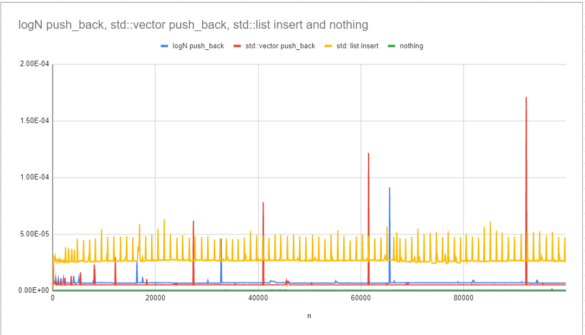

# Requirements
You're going to write a short PDF report about your code. The exact format is up to you!

Here's what I'd like you to think about when writing your report:

- What is the big-O of time for LogNVector methods?
- What's the big-O of space for LogNVector?
- How does the big-O of LogNVector methods compare to the equivalent methods in std::vector and std::list?
- How does the big-O (theory) compare to performance in real life (for LogNVector, std::vector, and std::list)?
- Anything else you want!
- Who helped you? (Cite your sources!)

# LogNVector Part 2
    Mokhalad Aljuboori
    10/2/2021
    CS 2C
    Mikel Mcdaniel

## Table of Contents
- [Requirements](#requirements)
- [LogNVector Part 2](#lognvector-part-2)
  - [Table of Contents](#table-of-contents)
  - [What is the Big-O of time for LogNVector Methods](#what-is-the-big-o-of-time-for-lognvector-methods)
    - [`push_back`](#push_back)
    - [`operator[]`](#operator)
    - [`initalizer_list` constructor:](#initalizer_list-constructor)
    - [`copy constructor`](#copy-constructor)
  - [What’s the big-O of space for LogNVector](#whats-the-big-o-of-space-for-lognvector)
  - [How does the big-O (theory) compare to the performance in real life (for LogNVector, std::vector, and std::list)](#how-does-the-big-o-theory-compare-to-the-performance-in-real-life-for-lognvector-stdvector-and-stdlist)

<hr>

## What is the Big-O of time for LogNVector Methods
### `push_back`
- Big-O: $O(LogN)$
- Amortized Big-O: $O(1)$
```cpp
void LogNVector<T>::push_back(const T &value){
    if (curr_array_capacity == 0) {
        ...        
    }
    .
    .
    arrays_[first][second] = value;
}
```
### `operator[]`
- Big-O: $O(1)$
```cpp
T &LogNVector<T>::operator[](int index){
    return arrays_[first][second];
}
```

### `initalizer_list` constructor:
- Big-O: $O(logN+N) = O(N)$

### `copy constructor`
- Big-O: $O(logN * (n + n) = O(N logN)$
```cpp
template <typename T>
LogNVector<T>::LogNVector(const LogNVector<T> &other) : size_(other.size_), capacity_(other.capacity_), curr_array_capacity(other.curr_array_capacity) 
{
    //O(logn)
    for (int i = 0; i <= max_first; ++i)
    {
        //O(n)
        this->arrays_.push_back(make_unique<T[]>(new_array_size));
        //O(n)
        for (int j = 0; j < new_array_size; j++) {
        }
    }
}
```
<hr>

## What’s the big-O of space for LogNVector
- Big-O of Space: $O(n + logn + k) = O(n)$ where n is the size of the array and k is some constant
  
The Big-O of space is the amount of memory that each element holds in LogNVector, in which each element holds $O(1)$ space, and n elements hold $O(n)$ space. Also plus the amount of memory that it's private data members holds, O(k) where k is some constant for capacity_, size_,... etc, and O(logn) for arrays_ private data memeber because in case that the LogNVector runs out of space in its current array, you have to push_back a new array that’s double the size of the old array. 


## How does the big-O (theory) compare to the performance in real life (for LogNVector, std::vector, and std::list)

- From the graph shown above, Big-O of `list.push_back` is $O(1)$ because of the relativley straight line.
- The Big-O of `vector.push_back` is $O(n)$  because if you imagine a line connecting the spikes, it will be a straight line, (linear)
- The Big-O of `LogNVector.push_back` is $O(log n)$, although you can't 100% verify this from the graph above.
